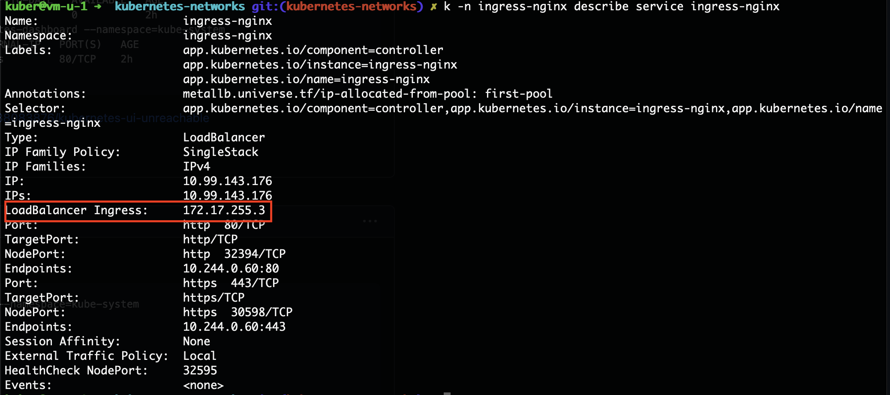
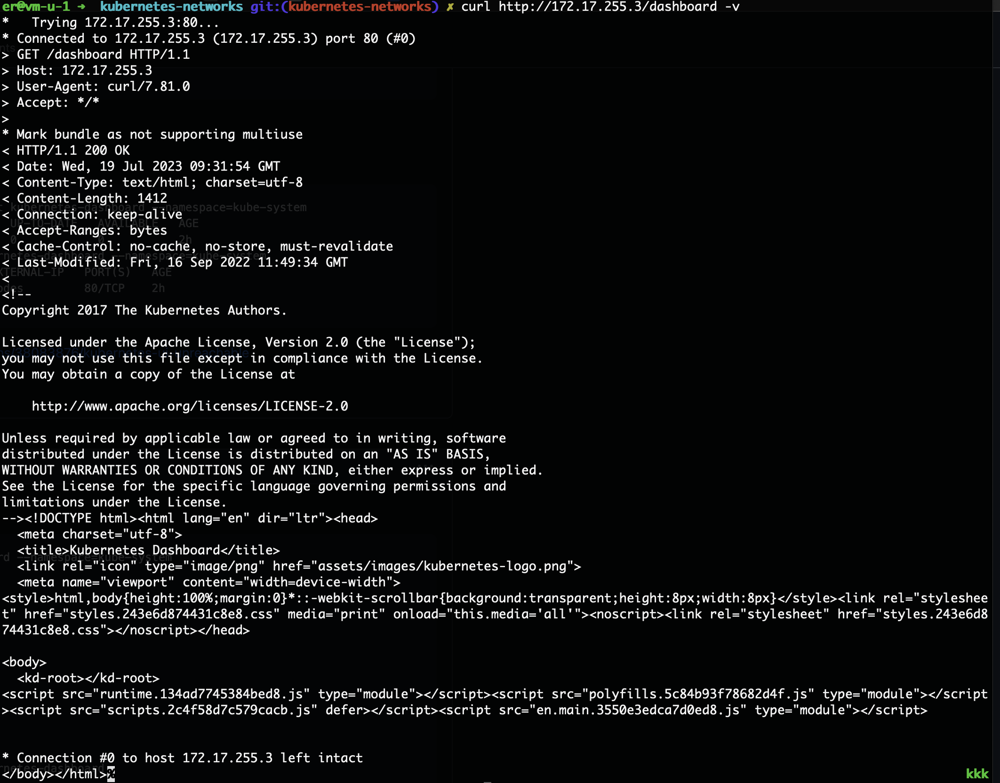
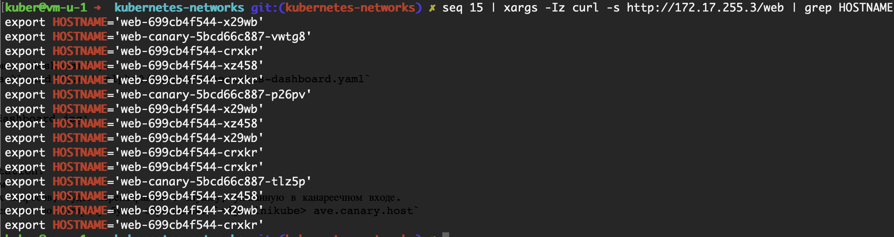

# Tippman_platform

## #1 Intro

### В процессе сделано:
- Собран и загружен в докер-хаб образ [tippman/kubernetes-intro](https://hub.docker.com/repository/docker/tippman/kubernetes-intro/general)
- Добавлен манифест `web-pod.yaml` для создания пода `web`. Под также содержит init контейнер для генерации страницы `index.html` и `volumes`.
- Собран и заружен в докер-хаб образ [tippman/hipster-shop-frontend](https://hub.docker.com/repository/docker/tippman/hipster-shop-frontend/general)
- Автоматически сгенерирован манифест `frontend-pod.yaml` для запуска пода с этим образом.
- Исправлен первоначальный запуск по сгенерированному манифесту `frontend-pod.yaml` (в контейнере отсутствовали переменные среды). Исправлены манифест называется `frontend-pod-healthy.yaml`.

В контейнере frontend отсутствовали переменные среды:
- PRODUCT_CATALOG_SERVICE_ADDR
- CURRENCY_SERVICE_ADDR
- CART_SERVICE_ADDR
- RECOMMENDATION_SERVICE_ADDR
- CHECKOUT_SERVICE_ADDR
- SHIPPING_SERVICE_ADDR
- AD_SERVICE_ADDR

_Вопрос: Разберитесь почему все pod в namespace kube-system восстановились после удаления. Укажите причину в описании PR_

**Ответ:**  
Поды неймспейса kube-system (за исключением `coredns`) - это static поды, которые управляются kubelet на основе манифестов:
```shell
docker@minikube:~$ ll /etc/kubernetes/manifests/
total 28
drwxr-xr-x 1 root root 4096 Jul 10 11:12 ./
drwxr-xr-x 1 root root 4096 Jul 10 11:12 ../
-rw------- 1 root root 2309 Jul 10 11:12 etcd.yaml
-rw------- 1 root root 4071 Jul 10 11:12 kube-apiserver.yaml
-rw------- 1 root root 3390 Jul 10 11:12 kube-controller-manager.yaml
-rw------- 1 root root 1436 Jul 10 11:12 kube-scheduler.yaml
```
Под `coredns` контролируется ReplicaSet, который будет поддерживать в "живом" состоянии все заданные поды.  
> A ReplicaSet ensures that a specified number of pod replicas are running at any given time...
```shell
kuber@kuber-server:~$ kubectl describe pods -n kube-system 
Name:                 coredns-787d4945fb-h2vxr
Namespace:            kube-system
Priority:             2000000000
Priority Class Name:  system-cluster-critical
Service Account:      coredns
...
Controlled By:  ReplicaSet/coredns-787d4945fb
...
```

## #2 Controllers

### В процессе сделано:
  - Развернут кластер с помощью kind с 3 master и 3 worker нодами.
  - Создан манифест с типом `ReplicaSet` **frontend-replicaset.yaml**.
  - Исправлены ошибки в манифесте. Отсутствовал блок `selector labels`
  - Попробовал вручную через команду увеличить количество реплик: 
    ```
    kubectl scale replicaset frontend --replicas=3
    ``` 
  - Изменена версия образа из которого `ReplicaSet` поднимает под. После применения манифеста убеждаемся, что образ с которого будут создаваться реплики подов изменился на указанную нами в манифесте версию
    ```
    $ kubectl get replicaset frontend -o=jsonpath='{.spec.template.spec.containers[0].image}'
    tippman/hipster-shop-frontend:v0.0.2
    ```
  - Добавлен `Probes` для `frontend.`
  - Добавлены `Deployment` манифесты для `paymentservice` с двумя стратегиями:
    - Аналог blue-green:
      ```
        strategy:
          rollingUpdate:
            maxUnavailable: 0
            maxSurge: 100%
      ```
    - Reverse Rolling Update:
      ```
        strategy:
          type: RollingUpdate
          rollingUpdate:
            maxUnavailable: 33%
            maxSurge: 0
      ```

  - Добавлен `DaemonSet` `node-exporter-daemonset.yaml`.
  - Чтобы `DaemonSet` мог разворачивать поды на мастер нодах нужно добавить блок `tolerations`:
    ```
        spec:
          tolerations:
            - key: node-role.kubernetes.io/control-plane
              operator: Exists
              effect: NoSchedule
            - key: node-role.kubernetes.io/master
              operator: Exists
              effect: NoSchedule
       ```


## #3 Networks

### В процессе сделано:
- Добавлены проверки подов `web`: `livenessProbe` `readinessProbe`.
- Добавлен `Deployment` `web-deploy.yaml` со стратегией развертывания.
- Добавлен `Service` с типом `ClusterIP` - `web-svc-cip.yaml` для доступа к `web` подам через статичный IP внутри кластера.
- Прокси кластера переведен в режим `ipvc`.
- Добавлен балансировщик нагрузки `IPAddressPool` `MetalLB` с пулом адресов `172.17.255.1-172.17.255.255`.
- - Добавлен `Service` `coredns/dns-svc-lb.yaml` с закрепленным IP для доступа к кластеру снаружи.
- Добавлен маршрут для резолвинга запросов с `IPAddressPool` в кластер:
  ```shell
  Kernel IP routing table
  ...
  172.17.255.0    192.168.49.2    255.255.255.0   UG    0      0        0 br-6d9f6291bbf3
  ...
  ```
- Добавлен `Ingress` `nginx-ingress` с контроллером.
- Приложение `web` подключено к `Ingress` с помощью  `web-ingress.yaml`
- Установлен `kubernetes-dashboard`. Доступ к нему осуществляется по IP балансировщика `MetalLB` с префиксом `/dashboard`.
- Добавлен `Deployment` с 3 репликами `web` приложения - `web-canary` для проверки `canary` распределения трафика.
- Добавлены `Service` и `Ingress` для `web-canary`.  

Вопросы по методичке:
1. Почему следующая конфигурация валидна, но не имеет смысла?
   ```
   livenessProbe:
      exec:
        command:
           - 'sh'
           - '-c'
           - 'ps aux | grep my_web_server_process'
   ```
   - Эта проверка будет проходить успешна в любом случае, т.к. при отсутствии процесса `my_web_server_process` grep вернет свой процесс
   ```shell
   user     344777  0.0  0.0   6476  2320 pts/0    S+   12:20   0:00 grep --color=auto my_web_server_process
   ```
2. Бывают ли ситуации, когда она все-таки имеет смысл?
   - В таком виде нет.

### Проверка работоспособности:
- Основная часть:  
  Внутри кластера выполнить `ipvsadm --list -n` и `ping clusterIP`.
- CoreDNS: 
  ```shell
  curl http://172.17.255.10/index.html
  nslookup coredns-svc-tcp.kube-system.svc.cluster.local 172.17.255.10
  ```
- MetalLB:
  ```shell
  curl http://172.17.255.3/web/index.html
  ```
  
- Dashboard:
  
- Canary:
  


## #4 Volumes

### В процессе сделано:
- Добавлен `StatefulSet` minio c PVC template запросом на 10Gi.
- Добавлен Headless `Service` minio.
- Созданы `Secrets` с кредами подключения к minio через `kubectl`.
  ```shell
  $ k create secret generic minio-access-key --from-literal=minio-access-key='minio'
  $ k create secret generic minio-secret-key --from-literal=minio-secret-key='minio123'
  ```
- Добавлена конфигурация использования `Secrets` в `StatefulSet` манифест minio.
- Добавлено 2 пода, разделяющих один `Volume` с типом `hostPath`.
- Добавлены манифесты PV и PVC для созданных подов.
- Проверено сохранение данных между подами, а также при их удалении.

### Проверка работоспособности:
Применить манифесты и проверить:
- Установку переменных среды из секретов:
  ```shell
  $ k exec -it minio-0 -- /bin/sh -c 'echo $MINIO_ACCESS_KEY'
  $ k exec -it minio-0 -- /bin/sh -c 'echo $MINIO_SECRET_KEY'
  ```
- Сохранение данных при удалении пода:
  ```shell
  $ k exec -it my-pod -- /bin/bash
  > echo "Hello, Kubernetes Volumes!" > /app/data/data.txt
  > exit
  $ k delete pod my-pod
  $ k apply -f my-pod2.yaml
  $ k exec -it my-pod2 -- /bin/bash
  > cat /app/data/data.txt
  Hello, Kubernetes Volumes!
  ```
  
## #5 Security

### В процессе сделано:
-  Добавлены ServiceAccount и роли:
  - bob: роль admin для кластера
  - dave: запрет на все действия с кластером
  - carol: без настройки ролей
  - Group ClusterRoleBinding для всех сервисных аккаунтов неймспейса `prometheus`
  - jane: роль `admin` в рамках namespace dev
  - ken: роль `view` в рамках Namespace dev

### Проверка работоспособности:
```shell
kubectl auth can-i get deployments --as system:serviceaccount:<namaspace>:<serviceaccount_name> [-n <namespace>]
```

## #6 Templating
### В процессе сделано:
- Поднят YandexCloud Managed Kubernetes кластер
- Добавлены helm репозитории `helm repo add <name> <repo url>`, repo urls:
  - https://kubernetes.github.io/ingress-nginx
  - https://charts.jetstack.io
  - https://chartmuseum.github.io/charts
  - https://helm.goharbor.io
- Установлено из helm чартов: `ingress-nginx`, `cert-manager` c ClusterIssuer:
    ```shell
    helm upgrade --install ingress-nginx ingress-nginx/ingress-nginx --namespace=ingress-nginx --create-namespace
    ```
    ```shell
    helm upgrade --install cert-manager jetstack/cert-manager --namespace cert-manager --create-namespace --set installCRDs=true
    kubectl apply -f kubernetes-templating/cert-manager/acme-cluster-issuer.yaml
    ```
- Добавлены values.yaml для `chartmuseum` и `harbor`. Установлены `chartmuseum` и `harbor` с валидными сертификатами:
    ```shell
    helm upgrade --install chartmuseum chartmuseum/chartmuseum --namespace=chartmuseum --create-namespace -f kubernetes-templating/chartmuseum/values.yaml
    ```
    ```shell
    helm upgrade --install harbor harbor/harbor --namespace harbor --create-namespace -f kubernetes-templating/harbor/values.yaml
    ```
- Добавлено описание использования `chartmuseum` в качестве собственного репозитория в chartmuseum/README.md
- Установлен `helfile` и добавлен helmfile.yaml с `ingress-nginx`, `cert-manager` и `harbor`
- Создан и задеплоен helm Chart для `hipster-shop`
- Создан и установлен Chart `frontend` с `values.yaml`. В temlates чарта добалены deployment, ingress и service со значениями из `values.yaml`. Чарт упакован и залит в `harbor`.
- Добавлена зависимость `frontend` в chart `hipster-shop`
- Чарты `frontend` и `hipster-shop` залиты в `harbor`:
  ```shell
  helm package kubernetes-templating/frontend
  helm push frontend-0.1.0.tgz oci://harbor.158.160.32.101.nip.io/hipster-shop
  ```
  ```shell
  helm package kubernetes-templating/hipster-shop
  helm push hipster-shop-0.1.0.tgz oci://harbor.158.160.32.101.nip.io/hipster-shop
  ```
- Kubecfg:
  - Добавлены yaml файлы для payment-service и shipping-service
  - Создан и установлен шаблон services.jsonnet
  ```shell
  kubecfg update services.jsonnet --namespace hipster-shop
  ```
- Kustomize:
  - Добавлены stage и prod манифесты для currencyservice из microservices-demo/currencyservice
  - Применены манифесты:
  ```shell
   # Apply resources from a directory containing kustomization.yaml - e.g. dir/kustomization.yaml
   kubectl apply -k kubernetes-templating/kustomize/overrides/stage
   kubectl apply -k kubernetes-templating/kustomize/overrides/prod
  ```

### Проверка работоспособности:
https://chartmuseum.158.160.32.101.nip.io  
https://harbor.158.160.32.101.nip.io


Kustomize:
```shell
cd kubernetes-templating/kustomize
kustomize build
```
